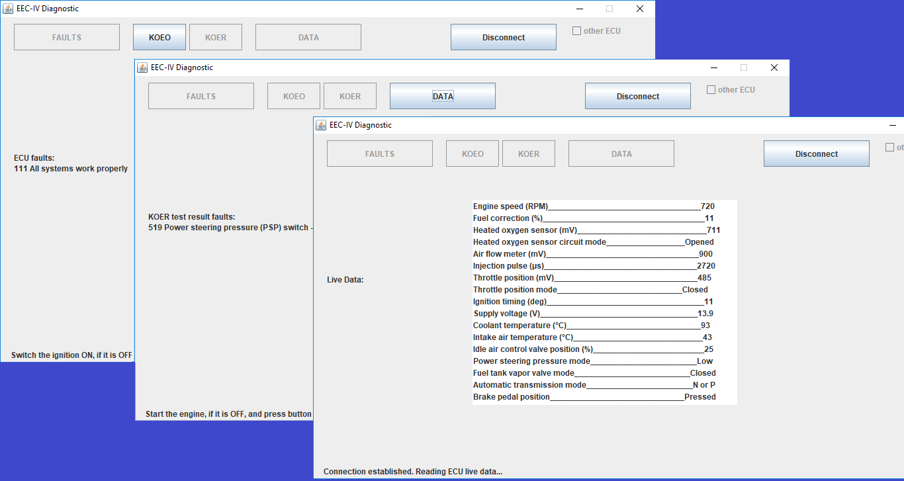

FORD EEC-IV diagnostic scanner
==============================
This is Java desktop project for petrol engine diagnostic for cars with
Ford EEC-IV ECU with DCL communication data bus which goes from ECU pins number 18 and number 19 from total 60.
Please be aware that many EEC-IV ECU do not have a DCL bus line, such as mono injection, engines with mechanical ignition distributor and diesels.

The principle is, that commands from USB port convert by bridge CP2101 to UART0 port of AVR controller, and instructions from other UART1 port of the controller convert by transceiver 75ALS176 for Ford EEC-IV diagnostic bus with Ford DCL communication standard which is the same as RS-485 standard with minor changes.
Usual USB-RS485 converter can not synchronize with ECU because of losing time for virtual COM port emulation, so the controller, in this case, is like a "cache" or a "buffer". Most of DCL command instructions, which were found experimentally, are in [DCL_communication_map.pdf][commap] file.
 
[](https://github.com/babroval/ford-eec-iv-scanner/blob/master/LICENSE)
```
  <dependency>
    <groupId>org.scream3r</groupId>
    <artifactId>jssc</artifactId>
    <version>2.8.0</version>
  </dependency>
```
Table of Contents
-----------------
  * [Requirements](#requirements)
  * [Usage](#usage)
  * [Contributing](#contributing)
  * [License](#license)  

Requirements
------------
  The FORD EEC-IV scanner interface board can be made independently or a ready module can be found, for example:
  * [Crumb128 V4 USB RS485 Modul][crumb128] with bootloader and quartz 16.0000MHz on chip45.com
  <br/>The first part of the code for AVR controller was creating in Assembly language. The EEC-IV_asm file is a bit messy, but it works! So  EEC-IV.hex for ATmega128 is included and ready to write flash memory by any cheap analog of AVR programmer:
  * [AVRISP][avrisp]
  <br/>In this part everything can be done with:
  * [AVR Studio 4][avr].14.589 and
  * [JRE][jre] 8


Usage
-----
The project is easy to manage with [Eclipse IDE][eclipse]:
File -> Import -> Git -> Projects From Git > URI

#### Error handling
All exceptions are converted into unchecked type to
keep code clean as possible.
<br/>
<br/>

Contributing
------------
To contribute to FORD EEC-IV scanner project, clone this repo locally and  
commit your code on a separate branch.
<br/>
<br/>

License
-------
Self-Storage Unit is licensed under the [MIT][mit] license.  

[commap]: https://github.com/babroval/ford-eec-iv-diagnostic/blob/master/DCL_communication_map.pdf/
[avrisp]: https://www.microchip.com/developmenttools/ProductDetails/atavrisp2
[crumb128]: https://www.chip45.com/atmega128-usb-rs485-module.html
[avr]: http://www.microchip.com/mplab/avr-support/avr-and-sam-downloads-archive
[jre]: https://www.java.com/en/download/
[eclipse]: https://www.eclipse.org/downloads/
[video]: https://youtu.be/0mJQrj8HoHk/
[mit]: https://github.com/babroval/ford-eec-iv-scanner/blob/master/LICENSE/

